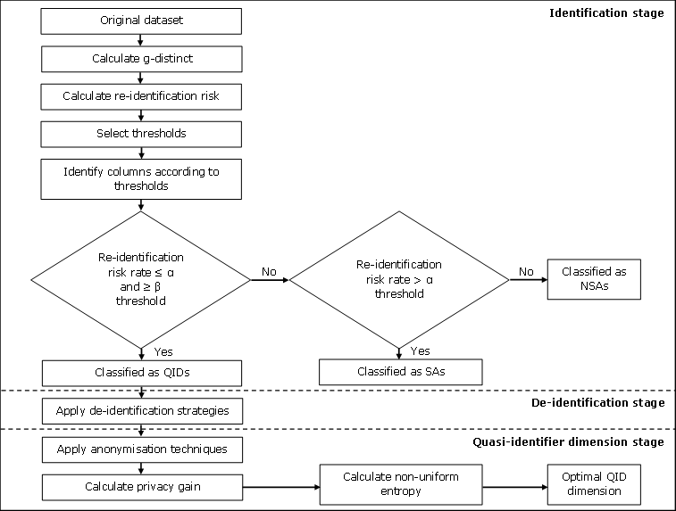
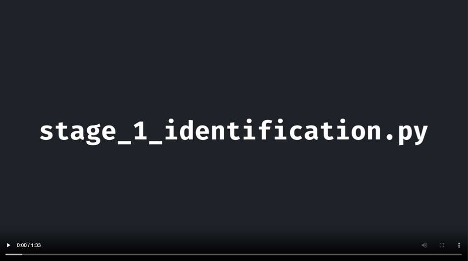

# Attribute Identification And Utility Metrics Pipeline

This repository contains Python scripts to identify attributes in a dataset and subsequently determine the best QID dimension based on privacy gain and non-uniform entropy. Two original datasets together with their de-identified datasets were provided to test the scripts. <br>
The following figure represents the flow of the pipeline. Note that the de-identification stage is not included in this repository and must be implemented using your preferred de-identification strategies.



## About the datasets

Both datasets were made up using a mock data generator, which can be found [here](https://github.com/MS-DATA-ALLIANCE/GDSI-Mock-DataGenerator). <br>
The original datasets that were used in the first script (stage_1_identification.py), are named accordingly. For the second script (stage_2_qid_dimension.py), the de-identified datasets are provided. These datasets were de-identified in order of descending risk rates and named according to the last de-identified attribute. For the 500 row dataset, an alpha threshold of 20 was used together with a beta threshold of 1. For the 1000 row dataset, these values were 10 and 1. <br>
The original datasets contain the following columns:

| **Column name**            | **Description**                                                                                                                                                                                                                                                                                                                                                                                                                                                                                                          |
|----------------------------|--------------------------------------------------------------------------------------------------------------------------------------------------------------------------------------------------------------------------------------------------------------------------------------------------------------------------------------------------------------------------------------------------------------------------------------------------------------------------------------------------------------------------|
| secret_name                | Indicates the unique identifier for the record. The beginning letters, namely “P_” or “C_”, indicate whether outcomes are patient-reported or clinician-reported outcomes, respectively. This column accepts data of the type “object”.                                                                                                                                                                                                                                                                                  |
| report_source              | Represents the source from which the data is collected. This column accepts data of the type “object”. <br> - “clinicians” <br> - “patients”                                                                                                                                                                                                                                                                                                                                                                             |
| sex                        | Shows the biological sex of the patient. This column accepts data of the type “object”. <br> - “male” <br> - “female”                                                                                                                                                                                                                                                                                                                                                                                                    |
| age                        | Contains the ages of the patients. This column accepts data of the “integer” type.                                                                                                                                                                                                                                                                                                                                                                                                                                       |
| edss                       | Indicates the score on the Expanded Disability Status Scale (EDSS) for a patient. The EDSS has a range of 0 to 10, where higher scores indicate higher levels of disability. The scoring is determined through an examination conducted by a neurologist. EDSS steps 1.0 to 4.5 refer to people with MS who can walk without any assistance and are evaluated based on impairment in 8 functional systems. EDSS steps 5.0 to 9.5 are defined by the impairment to walking. This column accepts data of the type “float”. |
| bmi                        | Represents the body mass index (BMI) of the patient. This column accepts data of the type “float”.                                                                                                                                                                                                                                                                                                                                                                                                                       |
| covid19_admission_hospital | Contains the hospital admission status of the patient as a result of COVID-19. This column accepts data of the type “object”. <br> - “yes” <br> - “no”                                                                                                                                                                                                                                                                                                                                                                   |
| covid19_confirmed_case     | Represents whether the patient had a confirmed COVID-19 diagnosis. This column accepts data of the type “object”. <br> - “yes” <br> - “no”                                                                                                                                                                                                                                                                                                                                                                               |
| covid19_diagnosis          | Shows the perceived COVID-19 diagnosis of the patient. This column accepts data of the type “object”. <br> - “not_suspected” <br> - “suspected”                                                                                                                                                                                                                                                                                                                                                                          |
| covid19_symptoms           | Represents the symptoms of patients. This column accepts data of the type “object”. <br> - “no” <br> - “congestion” <br> - “pneumonia” <br> - “sore_throat” <br> - “shortness_breath” <br> - “fever” <br> - “fatigue” <br> - “pain” <br> -  “chills”                                                                                                                                                                                                                                                                     |
| covid19_icu_stay           | Indicates whether the patient was admitted to the intensive care unit (ICU) of the hospital as a result of COVID-19. This column accepts data of the type “object”. <br> - “yes” <br> - “no”                                                                                                                                                                                                                                                                                                                             |
| covid19_outcome_recovered  | Shows whether a patient recovered from their COVID-19 infection. This column accepts data of the type “object”. <br> - “yes” <br> - “no” <br> - “not_applicable”                                                                                                                                                                                                                                                                                                                                                         |
| covid19_self_isolation     | Indicates whether the patient self-isolated. This column accepts data of the type “object”. <br> - “yes” <br> - “no”                                                                                                                                                                                                                                                                                                                                                                                                     |
| covid19_ventilation        | Indicates whether a patient was ventilated during their hospital stay. This column accepts data of the type “object”. <br> - “yes” <br> - “no”                                                                                                                                                                                                                                                                                                                                                                           |
| comorbidities              | Contains the comorbidities of a patient. This column accepts data of the type “object”. <br> - “no” <br> - “chronic_liver_disease” <br> - “immunodeficiency” <br> - “hypertension” <br> - “cardiovascular_disease” <br> - “diabetes” <br> - “lung_disease” <br> - “chronic_kidney_disease” <br> - “other” <br> - “malignancy”                                                                                                                                                                                            |
| ms_type                    | Indicates the type of MS. This column accepts data of the type “object”. <br> - “RRMS” <br> - “CIS” <br> - “PPMS” <br> - “not_sure” <br> - “SPMS”                                                                                                                                                                                                                                                                                                                                                                        |
| ms_diagnosis_date          | Represents the year in which the patient received their diagnosis for MS. This column accepts data of the “integer” type.                                                                                                                                                                                                                                                                                                                                                                                                |

## Tutorial video

Below, you can download and watch the tutorial video.
[](supporting_files/tutorial_video.mp4)

## How to use stage_1_identification.py

This script is designed to assist in the process of identifying and classifying attributes in a dataset based on their re-identification risk rates. It evaluates the attributes and classifies them into 3 categories: quasi-identifiers (QIDs), sensitive attributes (SAs), and non-sensitive attributes (NSAs). This classification is based on user-defined thresholds for re-identification risk.

### Prerequisites

Before running the first script (stage_1_identification.py), make sure you:
1. Have an original dataset.
2. Know which attributes are direct identifiers.

### Steps

1. Download an original dataset (e.g. stage_1_df_mock_1000.csv).
2. Run the Python script. It will prompt you to enter the path of the original dataset and the attribute name of direct identifier(s).
3. The script will filter out attributes where missing values exceed 85% and display them.
4. The script calculates the re-identification risks of the remaining attributes.
5. You will be prompted to enter alpha and beta thresholds, which will be used in the identification of attributes. Attributes surpassing the alpha threshold are labelled as SAs. Attributes with a risk rate lower than or equal to alpha but higher than or equal to beta are considered QIDs. The remaining attributes with a risk rate below the beta threshold are classified as NSAs. 
6. The script will classify the attributes into SAs, QIDs, and NSAs based on the selected thresholds.
7. The script gives advice on next steps to take. This includes de-identifying attributes in order of descending risk rates.

> Tip: Copy or write down the results from this stage. You will need the attribute names, their classification and the order in which you de-identified them in the next stage.

### Example output with the 1000 row dataset

```
Columns excluded because of missing values:
        covid19_self_isolation: 91.8

Re-identification risk rates:
        bmi: 20.98
        ms_diagnosis_date: 13.81
        edss: 10.04
        age: 2.66
        comorbidities: 1.8
        covid19_symptoms: 1.54
        ms_type: 0.67
        covid19_ventilation: 0.52
        covid19_outcome_recovered: 0.31
        covid19_confirmed_case: 0.26
        covid19_icu_stay: 0.26
        report_source: 0.2
        sex: 0.2
        covid19_admission_hospital: 0.2
        covid19_diagnosis: 0.2

Enter the α threshold (as a float): 10.0

Enter the β threshold (as a float): 1.0

Sensitive attributes:
        bmi: 20.98
        ms_diagnosis_date: 13.81
        edss: 10.04

Quasi-identifiers:
        age: 2.66
        comorbidities: 1.8
        covid19_symptoms: 1.54

Non-sensitive attributes:
        ms_type: 0.67
        covid19_ventilation: 0.52
        covid19_outcome_recovered: 0.31
        covid19_confirmed_case: 0.26
        covid19_icu_stay: 0.26
        report_source: 0.2
        sex: 0.2
        covid19_admission_hospital: 0.2
        covid19_diagnosis: 0.2

Advice:
        De-identify the columns according to their re-identification risk rates.
        Start with the column with the highest risk rate and end with the column with the lowest risk rate.
        Afterwards, proceed to the QID dimension stage.
```

## How to use stage_2_qid_dimension.py

This script helps to evaluate the privacy-utility trade-off for de-identification processes by computing privacy metrics such as k-anonymity, l-diversity, t-closeness, privacy gain, and non-uniform entropy. It serves as a guide in determining the optimal number of quasi-identifiers to de-identify for balancing privacy with utility.

### Prerequisites

Before running the second script (stage_2_qid_dimension.py), make sure you:
1. Have an original dataset where sensitive attributes are de-identified and direct identifiers and attributes where missing values exceed 85% are suppressed.
2. Have a dataset where all information is masked (values are changed to the value "x").
3. Have a new dataset for every additional attribute that is de-identified. De-identify datasets in order of descending risk rates and create a CSV file after each de-identification step. You should have as many datasets as there are quasi-identifiers. Ensure the tuples in the original dataset and the tuples in the de-identified datasets are in the same order since the algorithm compares privacy and utility based on this order.

### Steps

1. Download the de-identified datasets provided or have your de-identified datasets at hand.
2. Run the script. It will prompt you to provide the following input:
	1. The path of your original dataset where sensitive attributes are de-identified and direct identifiers and attributes where missing values exceed 85% are suppressed.
	2. The path of a dataset where all information is removed.
	3. All the QIDs as a comma-separated list in order of descending re-identification risk rate.
	4. All the SAs as a comma-separated list.
3. The script will prompt you to provide the QID(s) you de-identified and the according dataset until all QIDs are processed. Again, you should enter the QIDs in order of descending re-identification risk rate.

### Example output with the 1000 row dataset

```
De-identified QIDs: "age", "comorbidities", "covid19_symptoms"

        K-anonymity original:            1

        K-anonymity after:               110

        T-closeness original:            0.9750000000000001

        T-closeness after:               0.32376470588235295

                Sensitive attributes: bmi

                        L-diversity original:    1

                        L-diversity after:       3

                Sensitive attributes: ms_diagnosis_date

                        L-diversity original:    1

                        L-diversity after:       6

                Sensitive attributes: edss

                        L-diversity original:    1

                        L-diversity after:       2

        Privacy gain:                    109

        Non-uniform entropy:              4635.091083186598

        Non-uniform entropy (%):          69.05

        Inverse non-uniform entropy (%):  30.950000000000003

All QIDS were processed

Optimal QID Dimension: 3

Advice:
        You should de-identify the first 3 QIDS.
```